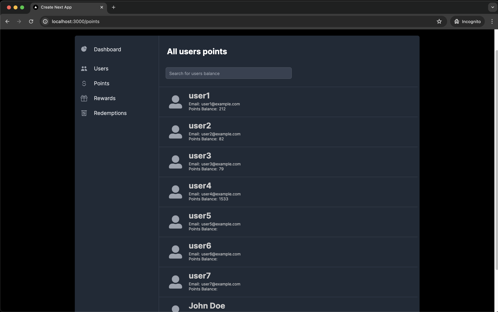

# Redeem Moderation System - Frontend Part

This project aims to evaluate my skills as a full-stack software engineer for a hiring company process.

<p align="center">
  
</p>

# Project Goal

This part of the entire project is the frontend send to the backend data.


## Project Tech Stack

In this project, I used some rola-related tech stacks to achieve the challenge goal. Listed below:

- NextJS 14;
- Typescript;
- SWR;
- Tailwind CSS;

## How to run

After make the clone of this repo and enter inside his folder, run the command: <br>
```sh
npm run install
```
this command will install all requeride dependencies of the project.

after that run: <br>
```sh
npm run dev
```

to start the project.

**OBS:** Is possible the need to be created data inside the container's database for displayng in the application.
     To achieve this you can use the Swagger interface on the backend part. The instructions are in the related
     repo README file.

## Backend Repository url: 
- Backend - [backend-repo](https://github.com/thomaslnx/RedeemSystemNode)

## Stay in touch

- Author - Marcos de Moura Silva
- Github - [thomaslnx](https://github.com/thomaslnx)
- Twitter - [@thomaslnx](https://twitter.com/thomaslnx)
